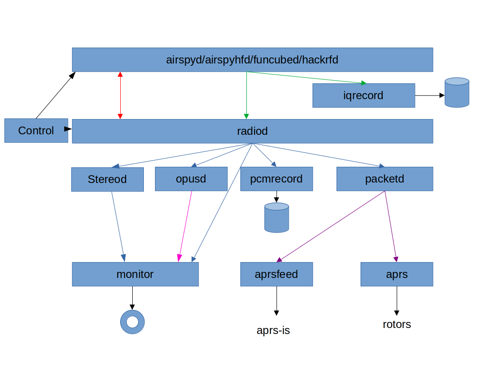

# Overview and documentation of ka9q-radio

by Dave Larsen, KV0S

# Overview

Phil Karn ka9q, developed a set of software defined radio receiver modules to demonstrate the utility of standard Internet real-time and multicast protocols for interprocess communication. The multicast streams convey complex digital IF sample streams, uncompressed and compressed audio and decoded physical layer frames (e.g., AX.25). One module can feed any number of others, and it is easy to move and restart individual modules without restarting the entire system. The package is currently being used for general analog reception and to process balloon APRS tracking transmissions but has many other applications including satellite operations and digital voice. The source code is in C, is available as open source 1 and runs on any UNIX-like operating system, including Mac OSX and Linux on Intel/ AMD x86 and ARM (e.g., Raspberry Pi) systems.

*ka9q-radio* is a software defined radio for Linux I've been working on for a few years. It is very different from most other amateur SDRs in several respects:

1. Efficient multichannel reception. A single Raspberry Pi 4 can simultaneously demodulate, in real time, every NBFM channel on a VHF/UHF band (i.e., several hundred) with plenty of real time left
over.

2. All I/O (both signal and control/status) uses IP multicasting. This makes it easy for more than one module, on the same computer or on a LAN, to operate on the outputs of other modules, or for
individual modules to be restarted without restarting everything else. 

If you want a user-friendly, interactive, graphics-laden SDR with a simple learning curve, then *ka9q-radio* is NOT what you're looking for! (At least not yet.) Try one of the many excellent SDR programs already available like SDR#, Cubic SDR, gqrx, etc, or the standalone Kiwi SDR.  This is my personal experiment in building a very different kind of SDR that runs as a component serving other applications.

The core components in *ka9q-radio* run as Linux 'daemons' (background programs) with little (or no) user interaction. Turnkey systems can be configured to, e.g., demodulate and record every FM channel on a band, or decode and relay digital messages (e.g., APRS, WSPR, Horus 4FSK, radiosondes). These programs are automatically launched by the (new) Linux standard system manager program *systemd*.

The core component is the *radiod* daemon. It accepts a (multicast) raw A/D stream from a front end module and executes a configured set of digital downconverters and simple demodulators for various linear and FM modes, including AM, SSB, CW and a raw IQ mode intended mainly for use by other programs.

Separate programs talk directly to several makes of SDR front end hardware and generates the I/Q stream for *radiod*. These programs currently include *airspyd* (Airspy R2), *airspyhfd* (Airspy HF+), *rtlsdrd* (generic RTL-SDR dongles), *funcubed* (AMSAT UK Funcube Pro+), *hackrf* (Great Scott Gadgets Hack RF One, receive only) and *rx888d* (RX-888 Mk II).

Two very rudimentary programs are provided for interactive use; *monitor* listens to one or more demodulated audio streams and *control* controls and displays the status of a selected receiver
channel.  It can also create and delete dynamic channel instances. The *control* program uses a flexible and extensible metadata protocol that could be (and I hope will be) implemented
by much more sophisticated user interfaces. Various utilities are provided to record or play back signal streams, compress PCM audio into Opus, pipe a stream into digital demodulators, etc.

Although I've been running all this myself for several years, it is NOT yet ready for general use. A LOT of work still remains, especially documentation. But you're welcome to look at it, make comments and even try it out if you're feeling brave. I would especially like to hear from those interested in building it into their own SDR applications

My big inspiration for the multichannel part of my project was this most excellent paper by Mark Borgerding: "Turning Overlap-Save into a Multiband Mixing, Downsampling Filter Bank". You probably won't understand how it works until you've read it:

https://www.iro.umontreal.ca/~mignotte/IFT3205/Documents/TipsAndTricks/MultibandFilterbank.pdf

Although there are other ways to build efficient multichannel receivers, most notably the polyphase filter bank, fast convolution is extraordinarily flexible. Each channel is independently tunable with its own sample rate and filter response curve. The only requirement is that the impulse response of the channel filters be shorter than the (configurable) overlap interval in the forward
FFT.

##### by Phil Karn ka9q

# Multicast

It's taken quite a beating in recent years, but I’m old fashioned enough to still believe in the “UNIX Philosophy”: each program should do one thing and do it well, with simple interfaces that can be used in novel ways the author may not have anticipated. The UNIX ‘pipeline’ was a seminal IPC (inter-process communication) scheme later extended to the Internet by TCP/IP.

UNIX pipes (and TCP connections) work well for point-to-point streams, and I’ve used them for signal processing. But they only have two endpoints, and you might want do drive several programs just as a 1 It's almost this simple. Some details are discussed later.hardware signal source can drive several loads through a splitter. You may want to start, stop or reconfigure one module (or move it to a different computer) without restarting everything else. In a high reliability application you might run the same program on two computers, one ready to take over if the other fails.

Sender flow control in one-to-many communication is problematic because one slow receiver might bog down others. Fortunately this isn’t necessary. A real time system processes data at a well defined rate, usually defined by an A/D converter clock. Buffering can handle momentary scheduling delays and jitter, but listeners simply must keep up on average. This makes sender flow control unnecessary.  Only listener flow control is needed, i.e., a listener must wait for a unit of data, process it, and wait for
the next unit. This simplifies things a lot.

GNU Radio already provides very flexible interconnections between signal processing modules within a single (large) program; in fact, it uses UNIX pipes internally. But I’m trying to solve a different problem: interconnecting signal processing modules that have different authors, are written in different programming languages, each with its own libraries and APIs, and run on different computers, hardware and operating systems. The Internet Engineering Task Force, the Internet protocol standards body, has (or had) a rule to standardize only “bits on wires”, i.e., actual network protocols; APIs and the like were implementation details considered out of scope. Another goal was scalability. These wise
choices -- standardizing just enough and no more -- led to the Internet's near-universal adoption by just about every computer, operating system and application.

IP is more flexible than GNU Radio’s IPC but it is also more costly. It would be wasteful to have a UDP/IP link from an oscillator to a multiplier (mixer) and another from the mixer to a detector, for example. But it can be used quite effectively at higher levels, e.g., from an SDR front end to a software tuner/demodulator, or from a tuner/demodulator to various recording and digital decoder programs. GNU Radio itself could receive, process and/or generate multicast IP streams, as could decoding programs like FLDIGI and WSJTX without relying on kludges like “virtual audio cables”. IP multicasting is especially useful for status and control messages so everyone can see what's going on.

# References

**Karn, Phil**, KA9Q (karn@ka9q.net) 2018. [Realtime Multicast for SDR Module Interconnection](https://tapr.org/40th-annual-arrl-and-tapr-digital-communications-conference/). 37th ARRL and TAPR Digital Communications Conference, Albuquerque, New Mexico.

**Karn, Phil**, KA9Q (karn@ka9q.net) 2021. [The KA9Q-Radio Package](https://tapr.org/37th-arrl-and-tapr-digital-communications-conference/). 40th ARRL and TAPR Digital Communications Conference, Virtual On-Line.

